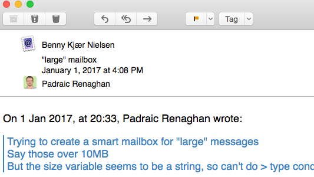
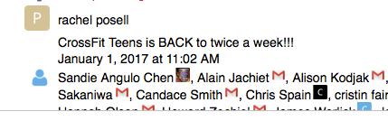

# Mailmate Resources

This directory is a sampling of what I have in ```/Users/me/Library/Application Support/MailMate/Resources```

My customizations to [MailMate](https://freron.com) Resource files to:

* Keyboard Shortcuts

* Customized header layout
  * Display Sender header prominently
    * Outlook calendar forwards make this important
  * Flip "Last, First" names to "First Last"
  * Show Name only (not Name and Address)
  * Click search is against "Any Address" using address (not name)
  * [Gravatar](https://www.gravatar.com/) avatar support for From, To, CC, BCC headers
  * Fallback to domain favicon if Gravatar not found
  * Use local avatar images for common addresses

* Avatars
  * In general, tries Gravatar first, then falls back to Favicon of address domain name
  * From: label replaced by avatar of from address
  * To/CC/BCC:
      * If only 1 recipient, header label replaced by their avatar
      * If > 1 recipient, and all recipients from the same domain, header label replaced by domain Favicon
      * Otherwise avatar displayed to right of each recipient name
      
* Customized Message Verifications
  * Catch replies to tool accounts (JIRA, CVS)
  * Don't respond via home email to a previously used work recipient (and vice versa)
  * If a new recipient make sure to send from home/work properly

Uses [jQuery](https://jquery.com) as referenced in ```headersFormatting.plist``` so make sure to download that and put in scripts directory.

Default icons (user, users, cvs, jira) are mostly colored PNG versions of [Font Awesome icons](http://fontawesome.io). But of course you can use any icon you like.

Replace all ```/Users/me/``` with your home directory.

Uses [Besticon](https://icons.better-idea.org) for Favicons which I have found works best. You can see other options commented out in the code. Also Favicon Finder is [open-source](https://github.com/mat/besticon) and you can run it locally if you like.

[MD5 script](http://www.myersdaily.org/joseph/javascript/md5-text.html) included inline in ```custom.js``` because I couldn't get it to work from its own script file.

# Examples



---



# Custom HTML Bundle to filter unwanted mail signatures and legal nonsense

* Copy ```eventFilters.plist``` from this repo to ``~/Libarary/Application Support/MailMate/Resources```
  * If you want to see how and when events fire, as well as their input and output, you can uncomment the Logger items on each event
  * Be sure to update the ```D``` variable in ```Bundles/MyHTMLFilter.mmBundle/Support/bin``` 

* Copy ```Bundles/MyHTMLFilter.mmBundle``` to ```~/Library/Application Support/MailMate/Bundles```

* The custom ```eventFilters.plist``` overrides the display_html event to route through a new ```MyHTMLFilter.mmFilter```
  * Which runs the perl script ```~/Library/Application Support/MailMate/Bundles/MyHTMLFilter.mmBundle/Support/bin/MyHTMLFilter.pl```
  * Edit this script, change the patterns section at the top to find and remove various junk like mail signatures and legal nonsense
  * Adjust the last line to output the message with or without debugging info

* I am no perl expert, but this seems to run very fast, improvements welcome
